<div align="center">

# roadmap-ai

**An AI tutor for any coding agent.**
It plans your whole learning path up front, writes each lesson just before you need it,
and rewrites the next one around what you got wrong.

[](SKILL.md)
[](#-for-agents)
[](package.json)
[](package.json)
[](test/)

[**See a live path**](https://byagent.dev/a/k2PhXJlzTVm1/) ·
[Install](#-install) ·
[For agents](#-for-agents) ·
[How it works](#-how-it-works) ·
[What we learned](#-what-the-first-run-taught-us)

<br>

<picture>
  <source media="(prefers-color-scheme: dark)" srcset="docs/images/map-dark.png">
  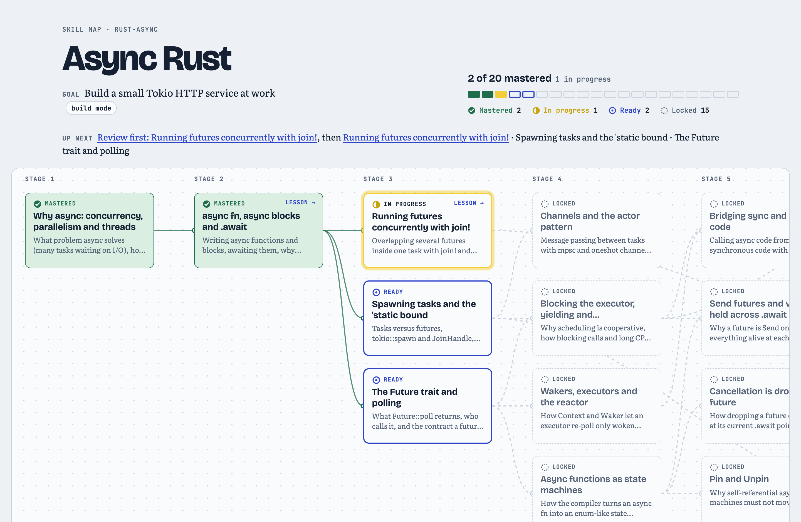
</picture>

<sub>A real skill map from the first run, updated after every quiz. Click it live <a href="https://byagent.dev/a/k2PhXJlzTVm1/">here</a>.</sub>

</div>

---

## Why

|  | Static roadmaps | Asking a chatbot | **roadmap-ai** |
|---|:---:|:---:|:---:|
| Whole path visible up front | ✅ | ❌ | ✅ |
| Starts from what you already know | ❌ | 🟡 if you explain | ✅ tested, not self-rated |
| Mastery is checked, not assumed | ❌ | ❌ | ✅ quiz gate per topic |
| Next lesson adapts to your mistakes | ❌ | ❌ forgets | ✅ |
| Ask about any line and get an answer in place | ❌ | 🟡 in a separate chat | ✅ |
| Claims backed by quotes checked on the live page | ❌ | ❌ | ✅ |

## ✨ What a learner gets

<table>
<tr>
<td width="50%" valign="top">

**Short, interactive lessons.** Written for your background and style, with objectives up front and an honest reading time.

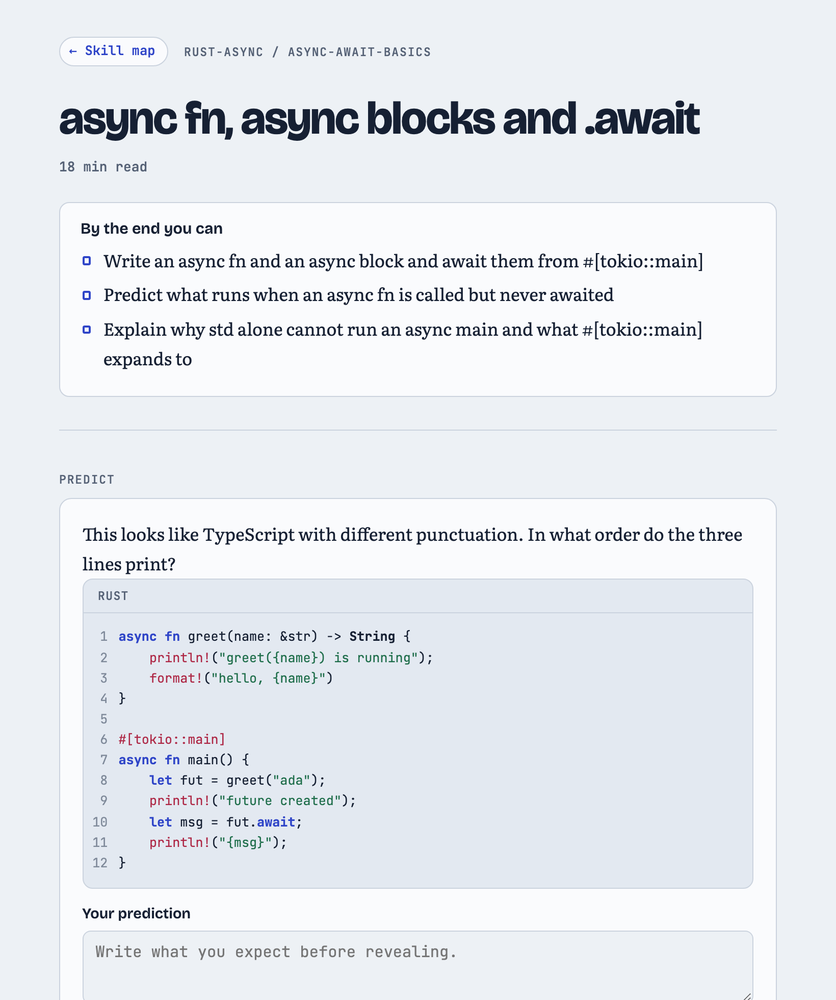

</td>
<td width="50%" valign="top">

**Warm-ups aimed at your last mistakes.** This learner passed the previous gate but missed how `#[tokio::main]` works, so the next lesson opens on exactly that.

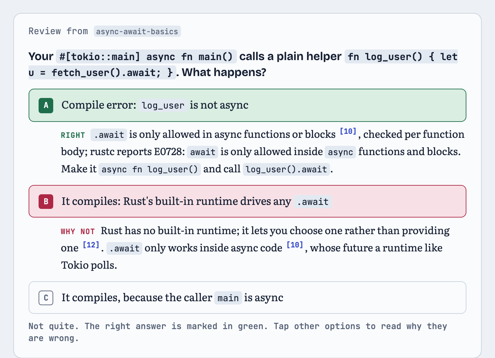

</td>
</tr>
<tr>
<td valign="top">

**Predict before you're told.** Commit to a guess, then reveal. The answer speaks to the belief you probably brought with you.

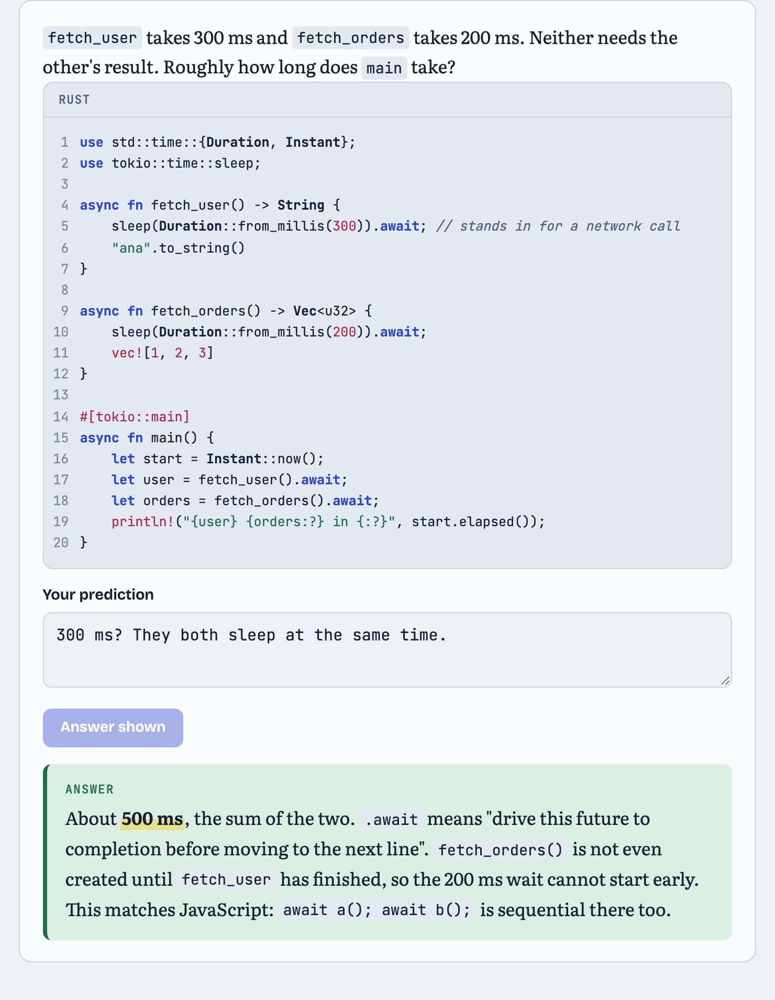

</td>
<td valign="top">

**Ask about any line.** Highlight a sentence and ask. The answer lands in the lesson right under that line, and the misconception it reveals shapes the next lesson.

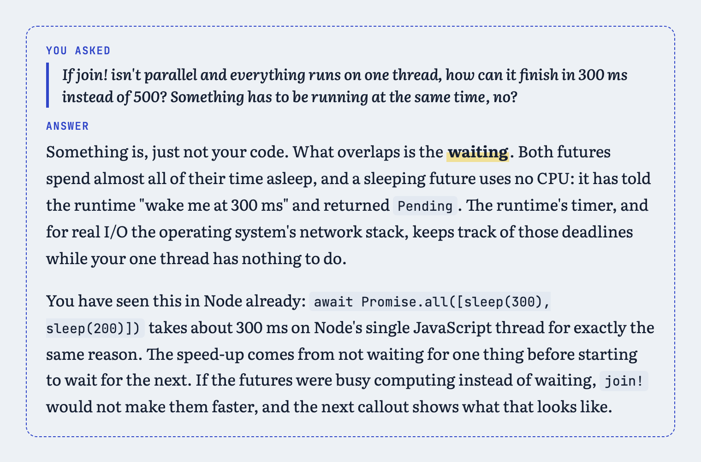

</td>
</tr>
<tr>
<td valign="top">

**Step through how it really works.**

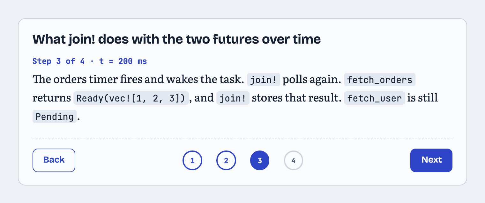

<br><br>

**Misconceptions named and corrected.**

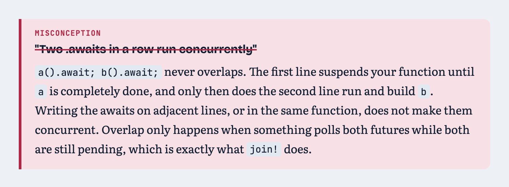

</td>
<td valign="top">

**Every quote checked on the live page.** A paraphrase fails the check. Only exact quotes ship.

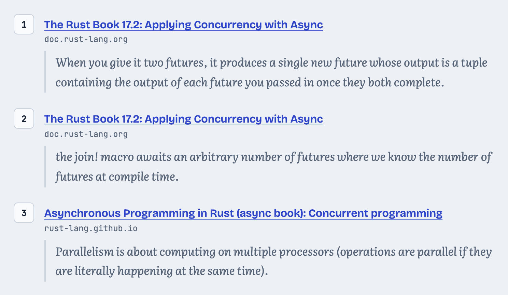

<br><br>

**Dark mode, and code that highlights properly.**

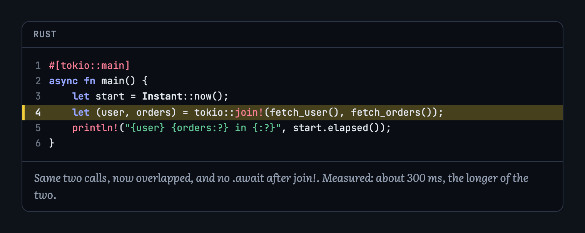

</td>
</tr>
<tr>
<td colspan="2" valign="top">

**Fail a gate and you get a review lesson from a different angle, not the same page again.**

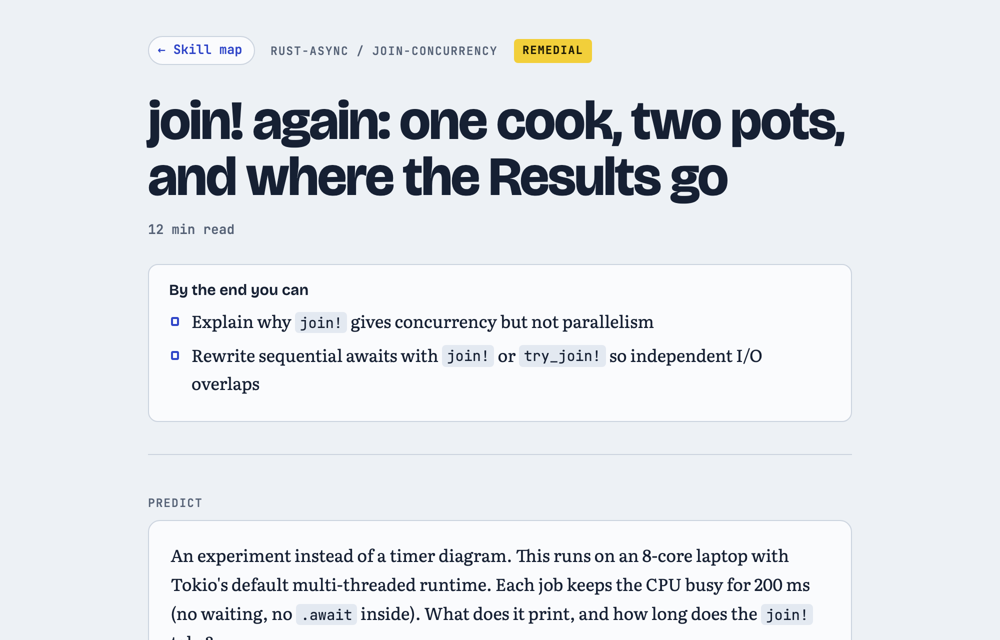

</td>
</tr>
</table>

## 🔁 How it works

Plan the whole path once. Write lessons only when they're needed, so each one can use what the learner just got wrong.

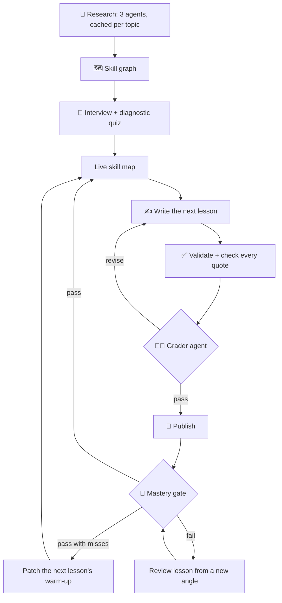

- **The path is planned up front, lessons are not.** Only the current lesson and one prefetched lesson exist at a time. Most learners stop early, and a lesson written on day 0 can't know what happened on day 3.
- **Lessons are JSON, not HTML.** Writer agents fill in a [small lesson format](docs/lesson-dsl.md). The page is built from tested widgets, so a model can't ship broken markup.
- **Two kinds of checking.** Code proves each quote is really on its page. A separate grader agent, which compiles the examples, judges whether each claim is true.
- **The learner model is explicit.** [`learner.json`](docs/data-model.md) holds mastery per topic, gate attempts, open misconceptions and questions asked. Every writer prompt is built from it.
- **Research is paid for once per topic** and shared by every learner.

## 📦 Install

With the open [skills](https://skills.sh) installer, for every agent on your machine at once:

```bash
npx skills add anup-a/roadmap-ai -g -a '*'
```

Or clone it into one agent's skills folder:

```bash
git clone https://github.com/anup-a/roadmap-ai ~/.claude/skills/learnpath   # Claude Code
git clone https://github.com/anup-a/roadmap-ai ~/.codex/skills/learnpath    # Codex
git clone https://github.com/anup-a/roadmap-ai ~/.agents/skills/learnpath   # shared folder
```

Then ask your agent: **"teach me async Rust"** (or `/learnpath` where slash commands exist).

**Requirements:** Node 20+ and `curl`. No npm install; there are no dependencies. Pages publish to [byagent](https://byagent.dev) (`npx byagent login` once). State lives in `~/.learnpath`; override with `LEARNPATH_HOME`.

## 🤖 For agents

Any agent that can run shell commands and write files can drive this. The skill is written against capabilities, not one vendor's tools. The full learning loop has been run in Claude Code. Codex found the skill in its own skills folder and drove `lp` using only `SKILL.md`. Cursor, Gemini CLI and OpenCode read the same `SKILL.md` format but haven't been tried yet.

### What your agent needs

| Capability | Needed? | Fallback |
|---|---|---|
| Shell + Node 20+ + `curl` | **Required** | none |
| Read and write files | **Required** | none |
| Subagents | Recommended | Run each prompt yourself, one after another. Grade in a separate pass after re-reading the lesson from disk, so the grader doesn't inherit the writer's context |
| Structured multiple-choice question tool | Optional | Ask in chat as a numbered list with lettered options |
| byagent login | Optional | `lp render-*` writes self-contained HTML you can open or host anywhere. You lose line comments |

### The contract

Your agent does the thinking; `lp` does the bookkeeping.

- **`lp` is the only way state changes.** Every command prints exactly one JSON object and exits `1` on failure. Never edit `learner.json` by hand.
- **`lp prompt <name>` builds complete prompts for sub-tasks** (`research`, `graph`, `diagnostic`, `lesson`, `grader`, `gate`, `patch`). It fills them from the graph and the learner model, and refuses to output a prompt with an unfilled placeholder.
- **Check writers' work yourself.** Run `lp validate-lesson` and `lp check-cites` after every writer, whatever the writer says.

```bash
LEARNPATH_DIR=~/.agents/skills/learnpath        # wherever you installed it
lp() { node "$LEARNPATH_DIR/bin/lp.mjs" "$@"; }

lp plan --graph "$G" --learner "$L"             # what to write next, and why
lp prompt lesson --graph "$G" --research "$RS" --learner "$L" --node future-trait \
   --set OUT=lesson.json --out prompt.md        # hand prompt.md to a writer agent
lp validate-lesson lesson.json && lp check-cites lesson.json
lp render-lesson lesson.json --out site/future-trait
lp gate prepare gate.json                       # shuffle options, print questions without the key
lp gate score gate.json --answers 2,0,1,3       # -> {score, missed, explain}
lp learner gate --graph "$G" --learner "$L" --node future-trait --score 0.75 --missed "…"
```

<details>
<summary><b>All <code>lp</code> commands</b></summary>

| Command | Does |
|---|---|
| `paths --topic --run` | Where the topic cache and run state live |
| `source <url> --find <phrase>` | Raw page text around a phrase, for copying quotes verbatim |
| `merge-research <files…>` | Merge parallel research into one file with stable source ids |
| `validate-graph`, `validate-lesson`, `check-cites` | The deterministic checks |
| `prompt <name>` | Build a sub-agent prompt from the current state |
| `learner init / diagnostic / start / gate / lesson / question / misconception / map` | Every learner-model change |
| `plan` | Current topic, what to generate (missing, stale, patch, remedial), which topics the warm-up should review |
| `brief --node` | The learner summary a writer sees |
| `gate prepare / score` | Shuffle a gate's options; score answers into `score` and `missed` |
| `render-lesson`, `render-map` | Build the self-contained pages |
| `status` | Progress across every topic |

</details>

### No skills support?

Point the agent at the playbook from its instructions file (`AGENTS.md`, `CLAUDE.md`, `.cursorrules`, …):

```markdown
When I ask to learn a topic, follow ~/.agents/skills/learnpath/SKILL.md step by step.
```

[`SKILL.md`](SKILL.md) is the full playbook: research, interview, diagnostic, lesson loop, gates and comments.

## 🧪 What the first run taught us

Dogfooded on async Rust with a simulated TypeScript developer. Every check below caught something real:

| Caught by | What went wrong | Now |
|---|---|---|
| Grader agent | A real Rust Book quote about `trpl::join` (a function you await) was cited for `tokio::join!` (a macro you don't). The quote check passed; the compiler didn't | The grader compiles code, and it is mandatory |
| Diagnostic | A lucky guess from JavaScript intuition would have skipped 5 topics | A right answer doesn't count if a prerequisite was answered wrong |
| Gate | The gate writer put every correct answer first | `lp gate prepare` shuffles options |
| Adaptation | One miss triggered a rewrite of a 2,000-word graded lesson | A pass with misses patches only the warm-up |

**Compared with plain chat** on the same lesson and grader ([full write-up](https://byagent.dev/a/RXgcRdQxy8K3/)):
plain chat was just as accurate on its first try, at about an eighth of the cost. roadmap-ai's edge isn't writing better prose. It's the gates, the learner model and the in-place answers, which a single chat reply can't do.

**Live pages from the run:**
[skill map](https://byagent.dev/a/k2PhXJlzTVm1/) ·
[lesson 1](https://byagent.dev/a/jH7LnIKAIP4f/) ·
[lesson 2, adapted](https://byagent.dev/a/z9dobDiDFY9r/) ·
[review lesson](https://byagent.dev/a/N47iG3fJ6mW2/) ·
[plain-chat version](https://byagent.dev/a/fbMQjjnEDHTf/)

## 🛠 Develop

```bash
npm test                                                   # 121 tests, node --test
node bin/lp.mjs validate-lesson examples/lesson-future-trait.json
node bin/lp.mjs check-cites examples/lesson-future-trait.json   # live network check
```

```
SKILL.md            the playbook your agent follows
bin/lp.mjs          the CLI: state, checks, prompts, rendering
lib/                learner model, graph, gate, citations, validators, renderers
prompts/            sub-agent prompts, filled by `lp prompt`
docs/               lesson format and data model
```
